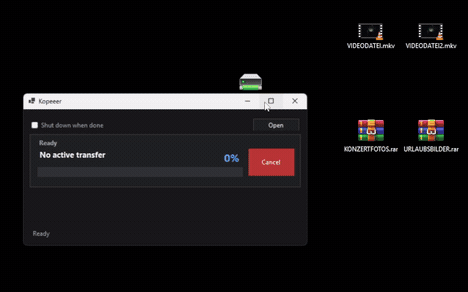

# Kopeeer

Kopeeer is a small Windows utility that queues copy and move operations from File Explorer and processes them one after another.

It lets you right-drag files or folders onto a destination folder, choose `Copy with Kopeeer` or `Move with Kopeeer`, and then processes the jobs one after another in a compact transfer window.

Status: `1.0.1`.

**[Download Kopeeer-Setup-1.0.1.exe](https://github.com/vr4w/kopeeer/releases/download/v1.0.1/Kopeeer-Setup-1.0.1.exe)**

Release page: [Kopeeer 1.0.1](https://github.com/vr4w/kopeeer/releases/tag/v1.0.1)



## Download For Windows

**[Download Kopeeer-Setup-1.0.1.exe](https://github.com/vr4w/kopeeer/releases/download/v1.0.1/Kopeeer-Setup-1.0.1.exe)**

This is the installer for normal Windows use. Download it, run it, and use Kopeeer from the Windows Explorer right-drag menu.

Source code ZIPs do not contain the installer. Download the installer from the [GitHub Releases page](https://github.com/vr4w/kopeeer/releases/latest).

## Install

If the direct download link above does not work, open the latest release and download the `.exe` file from there:

**[Open Kopeeer Releases](https://github.com/vr4w/kopeeer/releases/latest)**

```text
Kopeeer-Setup-1.0.1.exe
```

The installer asks for administrator approval because Windows Explorer loads the right-drag shell extension reliably when it is registered machine-wide.

SHA256 checksums are published with each release. Download the matching `.sha256` file from the release page and compare it with the installer before installing.

## What Works

- Explorer right-drag menu commands:
  - `Copy with Kopeeer`
  - `Move with Kopeeer`
- Classic right-click fallback commands for files and folders.
- Sequential copy/move queue.
- Compact borderless transfer window with:
  - current file name
  - overall progress bar
  - transfer speed
  - copied size such as `20 MB of 200 MB`
  - upcoming job list
  - upcoming file sizes
  - copy/move status per job
- Windows dark-mode aware UI.
- Explorer commands start Kopeeer automatically when no Kopeeer window is already running.
- Optional `Shut down when done`.
- Existing target files and folders are not overwritten silently.
- Canceled transfers clean up incomplete temporary files instead of leaving half-written final files.
- Self-contained Windows build; no separate .NET runtime is required for the installed app.

## Use

Preferred workflow:

1. In Explorer, drag one or more files or folders with the right mouse button.
2. Drop them onto a target folder.
3. Choose `Copy with Kopeeer` or `Move with Kopeeer`.
4. Watch progress in the small Kopeeer transfer window.
5. Use `Cancel` to stop the current queue and close the transfer window.

Fallback workflow:

1. Right-click a file or folder.
2. Choose `Copy with Kopeeer...` or `Move with Kopeeer...`.
3. Pick a destination folder.

## Test Safely

Use throwaway files first:

```powershell
mkdir C:\Temp\KopeeerTest
mkdir C:\Temp\KopeeerTest\Source
mkdir C:\Temp\KopeeerTest\Target
"hello" | Set-Content C:\Temp\KopeeerTest\Source\example.txt
```

Then right-drag `example.txt` onto `Target` and choose `Copy with Kopeeer`.

## Build From Source

Requirements:

- Windows 10 or Windows 11, 64-bit.
- .NET 8 SDK or newer.
- Visual Studio Build Tools with the C++ desktop workload.
- Inno Setup 6.

Build:

```powershell
dotnet build
```

Build installer:

```powershell
scripts\build-installer.ps1
```

Expected output:

```text
artifacts\installer\Kopeeer-Setup-1.0.1.exe
```

## Repository Shape

- `src/Kopeeer.App` - Windows transfer window.
- `src/Kopeeer.Core` - queue model.
- `src/Kopeeer.Worker` - sequential copy/move worker.
- `native/Kopeeer.ShellExtension` - native Explorer right-drag shell extension.
- `installer/inno` - Inno Setup installer.
- `scripts` - build, registration, and test helpers.
- `docs` - architecture and Windows integration notes.

## Notes

Kopeeer is intentionally small. It is not a file manager, cloud sync tool, backup app, clipboard manager, or TeraCopy clone.

The current Explorer integration is based on a native shell extension. Early experiments showed that left-drag modifier interception was not reliable on the tested Windows 11 Explorer path, while right-drag menu integration worked.

## Road To 1.0

Kopeeer `1.0.1` is the current stable Explorer-first release. Future work should stay focused on reliability, clearer troubleshooting, and broader Windows testing.

For major changes, test copy, move, conflict handling, cancellation, uninstall, and reinstall before publishing a new release.

## Troubleshooting

If the Explorer menu does not appear after installing, restart Explorer or sign out and back in once.

If Windows shows only the normal copy menu, make sure you are dragging with the right mouse button, then drop onto a folder and choose `Copy with Kopeeer` or `Move with Kopeeer`.

If Kopeeer opens but does not copy, uninstall Kopeeer, install the latest `.exe` from the release page again, and retry with a small test file first.

If Windows shows `Unknown publisher` or a SmartScreen warning, that is expected for now because Kopeeer is not code-signed yet. Only download the installer from the official GitHub Releases page, and compare the provided SHA256 checksum before installing.

Kopeeer installs diagnostic and repair tools here:

```text
C:\Program Files\Kopeeer\Tools\diagnose-installation.ps1
C:\Program Files\Kopeeer\Tools\repair-shell-integration.ps1
```

Run diagnostics from PowerShell if Explorer entries do not appear after installation.

## License

Kopeeer is open source under the [MIT License](LICENSE).

## Support

Kopeeer is free to use.

If Kopeeer saves you time or makes Windows file transfers a little less annoying, you can support the project here:

Buy me a coffee: [paypal.me/ALMOSTEVERYTHINGMS](https://www.paypal.com/paypalme/my/profile)
